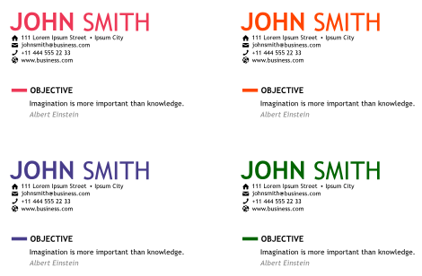

# Resume

Since I was bored of my old resume I designed a new one. One version I designed in HTML5 and CSS3. To make it as stable as possible I do not use any scripts. A further version I designed in SVG (using inkscape). This one has been converted to pdf.


## Colors

At the moment the red version is available only. However, different colors will be coming soon.



To get different colors you just have to edit the following lines in the header of index.html:

```html
  <link href="css/orange.css" media="screen" rel="stylesheet" type="text/css" />
  <link type="text/css" rel="stylesheet" href="css/print_orange.css" media="print"/>
```

Replace orange.css and orangeprint.css by blue.css/blueprint.css, red.css/redprint.css, green.css/greenprint.css.


## Typography 

I am not an expert in these things, so I used Trebuchet MS font. It is popular and whitespread. Besides it is a good sans serif alternative to Arial, which makes a slight difference.

## Pictograms

Thanks and all credits to Daniel Bruce for the beautiful pictograms. All of them (except countX.svg) have been taken from Daniels website — www.entypo.com.

## License

The work is licensed under Creative Commons. You are free to use the templates, also for commersial use. A mention like “Resume Template by Andreas Gschossmann — https://github.com/nerdOmat/resume ” is considered acceptable attribution. You can place this in the footer of your website, on an about page or in the code if you don’t wanna give it to much attention.

## TODO

 - [ ] add colors (blue.css, red.css, orange.css, green.css)
 - [ ] automize content management (change both, html5 and svg and put content into one xml-file)
 - [ ] make two versions (with and without image)
 - [x] add print.css
 - [x] embed qr-code in SVG and PDF-version
