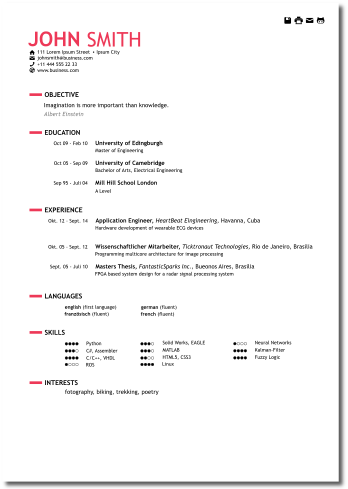

# Resume

Since I was bored of my old resume I designed a new one. One version I designed in **HTML5** and **CSS3**. To make it as stable as possible I do not use any scripts (except for printing, if JavaScript is activated). A further version I designed in **SVG** (using inkscape). This one has been converted to **PDF** (if inkscape is installed, svg2pdf.py can be used for this purpose).



## Colors

Colors are available:


To get different colors you just have to edit the following lines in the header of index.html:

```html
  <link href="css/orange.css" media="screen" rel="stylesheet" type="text/css" />
  <link type="text/css" rel="stylesheet" href="css/print_orange.css" media="print"/>
```

Replace orange.css and orange\_print.css by 
  - blue.css and blue\_print.css,
  - red.css and red\_print.css,
  - or green.css and green\_print.css.

Also the path to the PDF-file in the printPDF-script in the beginning of index.html must be changed to the according color. 

```javascript
  var page = window.open('../../svg/orange.pdf')

## Print

**Print Icon:** If JavaScript is activated, the PDF is opened in print-mode. If JavaScript is not activated, pressing the print-icon just follows a link to the PDF-version.

**Browsers Print Tool:** For styling the print-version print.css was written. In the case that the browsers internal print tool is used print.css hides all content of the website and embeds the SVG-version of the cv.

## Typography 

I am not an expert in these things, so I used Trebuchet MS font. It is popular and whitespread. Besides it is a good sans serif alternative to Arial, which makes a slight difference.

## Pictograms

Thanks and all credits to Daniel Bruce for the beautiful pictograms. All of them (except countX.svg) have been taken from Daniels website — www.entypo.com.

## License

The work is licensed under Creative Commons. You are free to use the templates, also for commersial use. A mention like “Resume Template by Andreas Gschossmann — https://github.com/nerdOmat/resume ” is considered acceptable attribution. You can place this in the footer of your website or in the code if you don’t wanna give it to much attention.

## TODO

 - [x] add colors (blue.css, red.css, orange.css, green.css)
 - [ ] automize content management (change both, html5 and svg and put content into one xml-file)
 - [ ] make two versions (with and without image)
 - [x] add print.css
 - [x] embed qr-code in SVG and PDF-version
